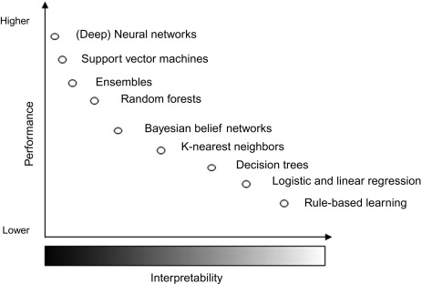

# Xai-example (WIP)
Repository on Explainable Ai 



## Set-up
- Conda Environment
```sh
conda create -n xai python=3.10
conda install anaconda::ipykernel
conda install anaconda::pandas
conda install anaconda::scikit-learn
conda install conda-forge::matplotlib
conda install anaconda::seaborn
conda install anaconda::graphviz conda-forge::python-graphviz conda-forge::pydot
conda install -c conda-forge pydotplus
conda install -c conda-forge shap
```


- Interpretable by design
    - decision tree
    - logistic regression
- Black box
    - 


- Scope
    - global
    - local

Techniques
    - LIME
    - SHAP
    - PDP and ICE
    - integrated gradient

Models
    - logistic regression / linear regression
    - decision tree / random forest
    - KNN (clustering)
    - XGBoost 
    - Bayesian network
    - Neural network (ANN, BERT)

- Categorical Encoding
    - https://medium.com/towards-data-science/encoding-categorical-data-explained-a-visual-guide-with-code-example-for-beginners-b169ac4193ae
    - https://medium.com/aiskunks/categorical-data-encoding-techniques-d6296697a40f

- https://stackoverflow.com/questions/65110798/feature-importance-in-a-binary-classification-and-extracting-shap-values-for-one
https://medium.com/@kumar9059300448/understanding-interpretable-machine-learning-exploring-shap-lime-pdps-and-ices-9239b497f065

Dataset
    - https://www.kaggle.com/datasets/asinow/laptop-price-dataset
    - https://www.kaggle.com/datasets/murtadhanajim/vocal-gender-features
    - https://www.kaggle.com/datasets/habedi/developer-salary-survey-data-norway-2024
    - https://www.kaggle.com/datasets/ruchikakumbhar/obesity-prediction
    - https://www.kaggle.com/datasets/ankushpanday1/alzheimers-prediction-dataset-global
    - https://www.kaggle.com/datasets/taweilo/wine-quality-dataset-balanced-classification