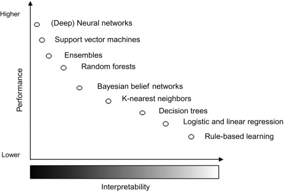

# Xai-example (WIP)
Repository on Explainable Ai 



## Set-up
- Conda Environment
```sh
conda create -n xai python=3.10
conda install anaconda::ipykernel
conda install anaconda::pandas
conda install anaconda::scikit-learn
conda install conda-forge::matplotlib
conda install anaconda::seaborn
conda install anaconda::graphviz conda-forge::python-graphviz conda-forge::pydot
conda install -c conda-forge pydotplus
conda install -c conda-forge shap
conda install conda-forge::xgboost
pip3 install torch torchvision torchaudio
```


- Interpretable by design
    - decision tree
    - logistic regression
- Black box
    - 


- Scope
    - global
    - local

Techniques
    - LIME
    - SHAP
    - PDP and ICE
    - integrated gradient

type
    - clustering
    - binary classification
    - multi-class classification
    - multi-label classification
    - Neutral network
    - deep neutral network (BERT)

Models
    - logistic regression / linear regression
    - decision tree / random forest
    - KNN (clustering)
    - XGBoost 
    - Bayesian network
    - Neural network (ANN, BERT)

- Categorical Encoding
    - https://medium.com/towards-data-science/encoding-categorical-data-explained-a-visual-guide-with-code-example-for-beginners-b169ac4193ae
    - https://medium.com/aiskunks/categorical-data-encoding-techniques-d6296697a40f

- https://stackoverflow.com/questions/65110798/feature-importance-in-a-binary-classification-and-extracting-shap-values-for-one
https://medium.com/@kumar9059300448/understanding-interpretable-machine-learning-exploring-shap-lime-pdps-and-ices-9239b497f065

https://www.youtube.com/watch?v=UJeu29wq7d0&list=PLqDyyww9y-1SJgMw92x90qPYpHgahDLIK&index=3
https://medium.com/towards-data-science/introduction-to-shap-with-python-d27edc23c454
https://medium.com/towards-data-science/shap-for-categorical-features-7c63e6a554ea

https://github.com/shap/shap/blob/master/notebooks/tabular_examples/tree_based_models/Explaining%20a%20simple%20OR%20function.ipynb
https://medium.com/swlh/push-the-limits-of-explainability-an-ultimate-guide-to-shap-library-a110af566a02

Dataset
    - https://www.kaggle.com/datasets/asinow/laptop-price-dataset
    - https://www.kaggle.com/datasets/murtadhanajim/vocal-gender-features
    - https://www.kaggle.com/datasets/habedi/developer-salary-survey-data-norway-2024
    - https://www.kaggle.com/datasets/ruchikakumbhar/obesity-prediction
    - https://www.kaggle.com/datasets/ankushpanday1/alzheimers-prediction-dataset-global
    - https://www.kaggle.com/datasets/taweilo/wine-quality-dataset-balanced-classification


Features
- Background: https://github.com/shap/shap/blob/master/notebooks/tabular_examples/tree_based_models/Explaining%20a%20simple%20OR%20function.ipynb
- https://arxiv.org/pdf/2006.16234
- https://stackoverflow.com/questions/70510341/shap-values-with-pytorch-kernelexplainer-vs-deepexplainer

Limitations:
https://medium.com/towards-data-science/kernelshap-can-be-misleading-with-correlated-predictors-9f64108f7cfb
https://github.com/shap/shap/issues/318#issuecomment-437429986
https://medium.com/data-reply-it-datatech/explainable-ai-shap-values-1c7128ef06c2
https://github.com/shap/shap/discussions/1538